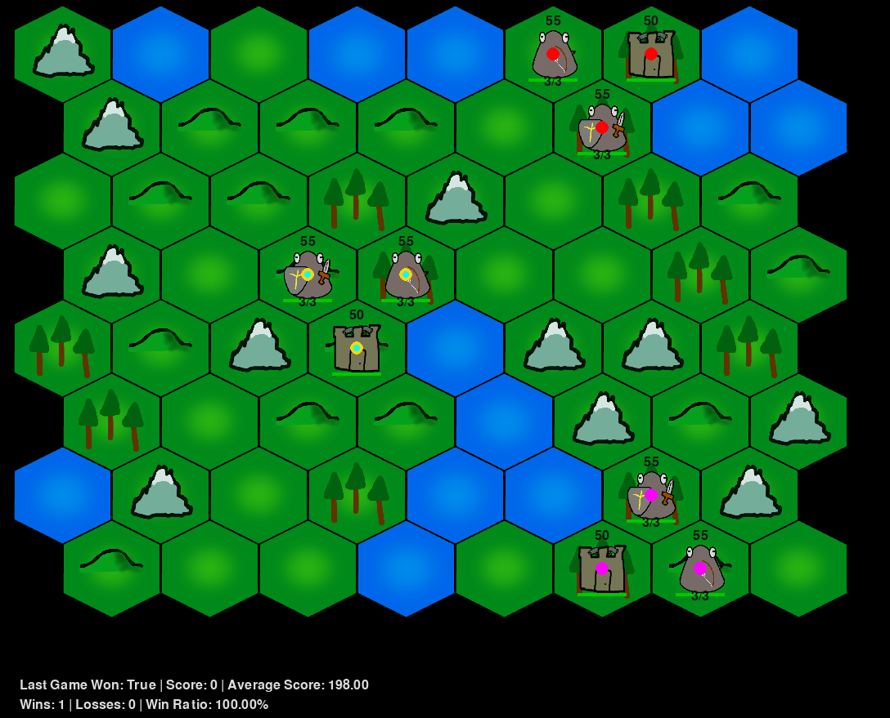
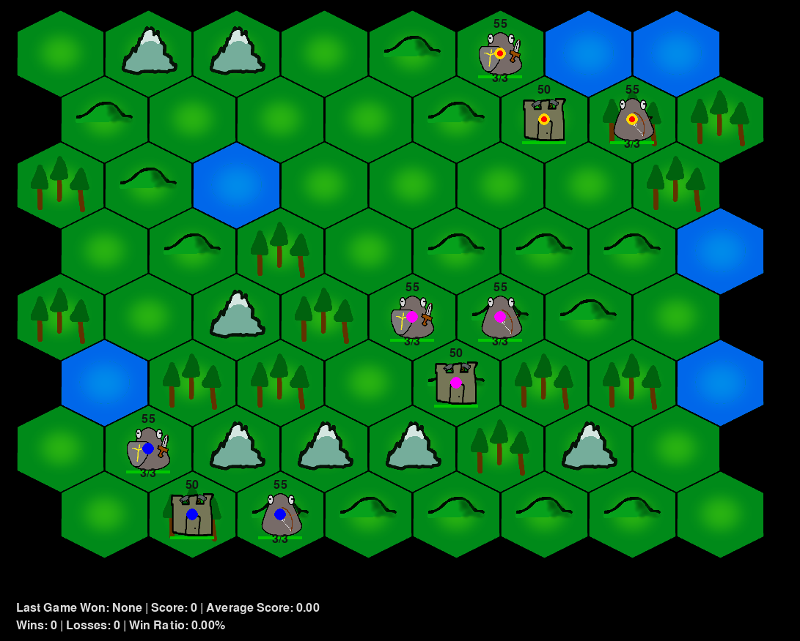
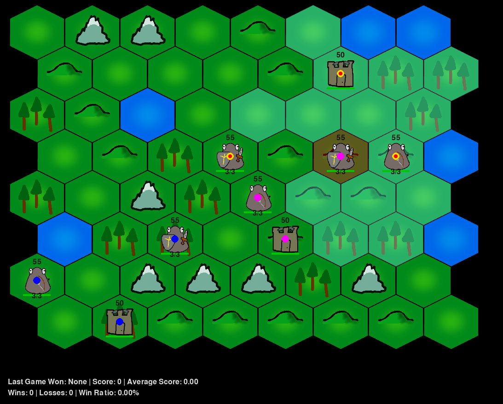
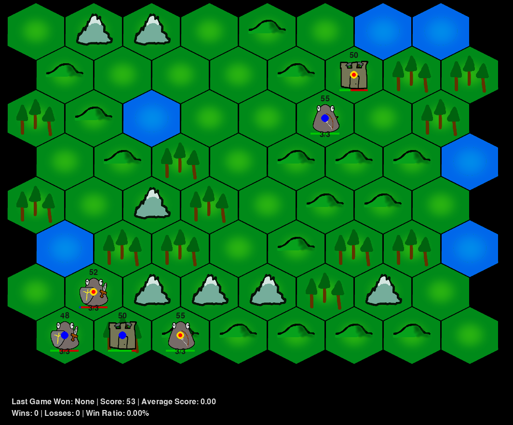

# CivCombat

Welcome to CivCombat, a turn-based strategy game inspired by the Civilization game trilogy. Designed for both Multi-Agent and Single-Agent reinforcement learning, CivCombat is built on the gymnasium RL framework. Our goal is to eventually integrate it into the Gymnasium or PettingZoo libraries.

## Game Preview

Dive into the world of CivCombat with these preview images showcasing our procedurally generated terrains and gameplay dynamics.

### Procedurally Generated Terrain Example #1

### Procedurally Generated Terrain Example #2

### Gameplay: Movement and Attacking

### Endgame: Eliminating a Civilization

## Game Features

### Dynamic Terrain
- **Hexagonal Grid:** Our terrain is a hexagonal grid, each tile representing diverse environments.
- **Tile Types:** Includes Water, Mountain, Hills, Forest, and Plains. Each with unique movement costs.
- **Obstacles:** Water and Mountain tiles are non-traversable, adding strategic depth to gameplay.
- **Procedural Generation:** Tiles are dynamically generated, using a tile matrix for realistic terrain layouts.

### Entities and Gameplay Mechanics

- **Warrior:** Attacks within 1 tile range. Can move up to 3 tiles.
- **Archer:** Engages enemies within a 2 tile range. Also moves up to 3 tiles.
- **City Center:** The heart of your civilization. Immovable and vital for your survival, it controls a 3 hex range area.

Entities have unique abilities and constraints, including attack ranges and movement capabilities. Players can also fortify troops for enhanced defense by moving to the same position as the troop.

### User Interface

- **Zooming:** Easily zoom in and out using '+' and '-' keys.
- **Panning:** Click and drag with the mouse to explore the map.
- **Interaction:** Click on units to view possible movements or attack options.

## Roadmap for Future Development

- Training of troops for enhanced combat skills.
- Introduction of more buildings, including specialized training facilities.
- Implementation of resource collection mechanics.
- Introduction of Fog of War for strategic gameplay.
- Establishment of alliances and diplomatic relations.

Stay tuned for more updates as we expand the world of CivCombat!
